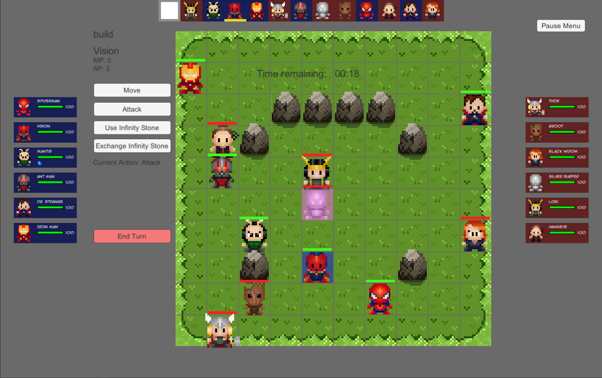
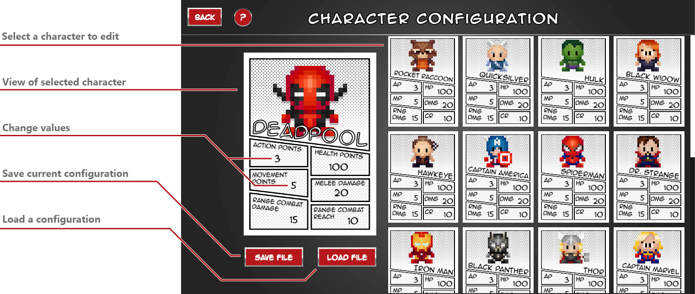
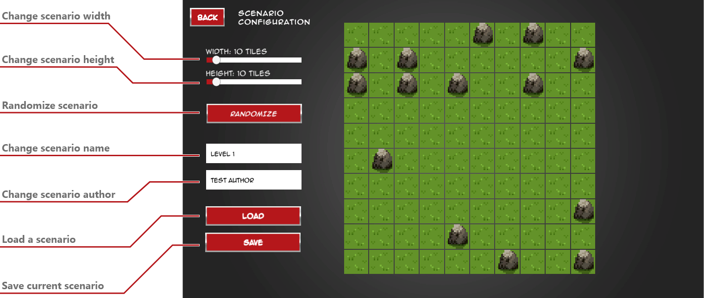
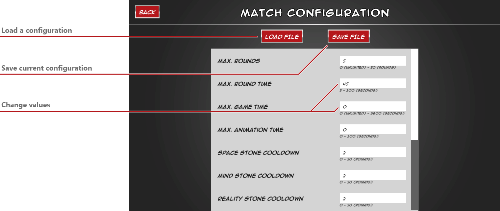
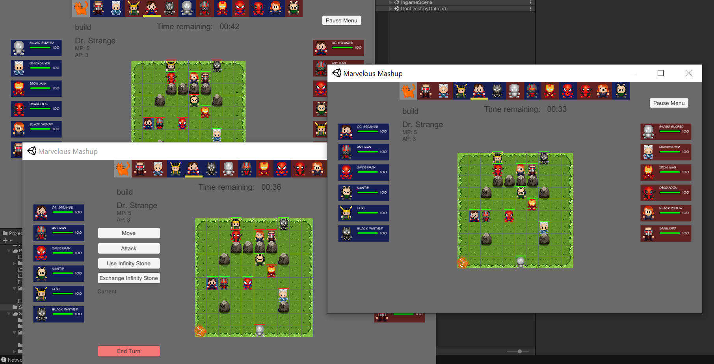

# Marvelous Mashup - Team 26

Welcome to the Marvelous Mashup project, a collaborative effort by Team 26 during our Bachelor studies at Ulm University. This project encompasses a multi-component game system, comprising an AI client, a game editor, a game client, and a server. The system facilitates a turn-based strategy game where players maneuver characters across a grid-based map to accomplish objectives.

## Game Client

The Game Client is the interface through which players interact with the game. It communicates with the server to send player actions and receive updates about the game state. The Game Client also sends move requests to the server, similar to the AI client.

## AI Client

The AI client is responsible for making decisions in the game. It uses various algorithms to determine the best course of action based on the current game state. The AI client sends move requests to the server, which includes the origin entity, the origin field, and the target field.

## Editor

The Editor is a tool for creating and editing game scenarios. It provides a user-friendly interface for designing game maps, placing game entities, and setting game parameters. The Editor uses a `ScenarioConfig` class to define the scenario, including the author, name, and the scenario grid.

## Server

The Server manages the game state and handles communication between the AI client and the game client. It processes player actions, updates the game state, and sends updates to the clients. The server is initialized with a port, logic, and a response time.

